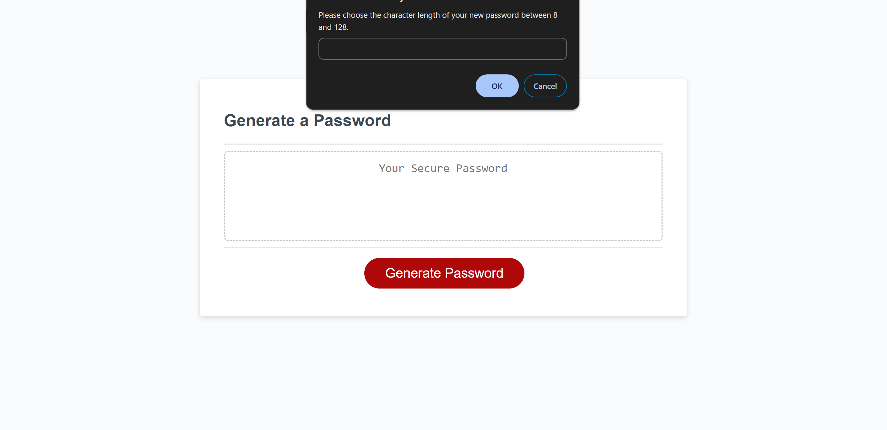

# Project Description

A study in generating randomized passwords in JavaScript

worked with keegan, george, and meera in a 1/7 study group.

## Contents

- [Introduction](#introduction)
- [Problem](#problem)
- [Solution](#solution)
- [Deployment](#deployment)
- [Collaborators](#collaborators)
- [Resources](#resources)
- [License](#License)

## Introduction

Client desired a random password generator to be built. Client provided starter code including a finished HTML and CSS file, and an incomplete JavaScript file in which to build the generator. I set out to use what I've learned so far in the UC Berkeley Coding Bootcamp to refactor this project's code to properly generate random passwords dependent on user inputs.

## Problem

I was given the code for this project in the following state:

- HTML file was complete.
- CSS file was complete.
- JavaScript file contained starter code to get refs to the #generate element, write password to the #password input, and add event listener to the generate button.
- JavaScript file lacked code to generate a random password dependent on user input.

## Solution

I rectified the above problems in the following way:

- I created the generatePassword function.
- I declared variables for each user choice.
- I added arrays to each variable containing all possible character values.
- I added conditional statements to direct user input through prompts and alerts.
- I concatenated the values of each choice.
- I generated the final password using a for loop.
- I returned the final password to the user.

See below for a screenshot of the project post-refactor.

## Deployment

[Link to the GitHub repo for this project](https://github.com/Aoliva96/password-generator)

[Link to the deployed project on GitPages - Coming Soon!]()

## Collaborators

I collaborated with Keegan Royal-Eisenberg, George Shultz, and Meera G.K. in a study-group on 1/07/24, in which we compared code and attempted to find solutions to each others' bugs.
I made modifications to the following areas of my code while comparing with Meera G.K., as our initial approaches were the most similar of the group.

- used window.confirm and window.alerts while prompting for user input.
- checked whether users entered any parameters at all with a conditional statement.
- checked whether users enter a NaN value for password length during the first prompt.

### Note, project code still incomplete after 1/07 study group. I made the following changes after seeking advice in 1/08 class office hours.

-

## Resources

See the links below to see some of the resources I used for this project:

[MDN Webdocs guide to Math.random & Math.floor](https://developer.mozilla.org/en-US/docs/Web/JavaScript/Reference/Global_Objects/Math/random)

[W3 Schools guide to for loops in JavaScript](https://www.w3schools.com/js/js_loop_for.asp)

[MDN Webdocs guide to arrays in JavaScript](https://developer.mozilla.org/en-US/docs/Web/JavaScript/Reference/Global_Objects/Array)

I also referenced the "Rock, Paper, Scissors" in-class JavaScript activity to build the system that prompts for user input.

## License

This project utilizes the standard MIT License.
